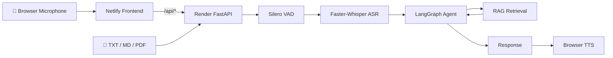

<div align="center">

# 🎙️ Enterprise Voice AI & OmniAgent Platform

### Real-time Voice AI • RAG • LangGraph • ASR • VAD • Cloud Deployment

[](https://enterprise-voice-ai-omniagent.netlify.app/)
[](https://enterprise-voice-ai-omniagent.onrender.com/health)
[](https://www.python.org/)
[](https://fastapi.tiangolo.com/)

**An end-to-end voice agent that turns spoken questions into grounded, context-aware responses using speech recognition, voice activity detection, LangGraph orchestration, and retrieval-augmented generation.**

<br/>

<a href="https://enterprise-voice-ai-omniagent.netlify.app/"><strong>🚀 Try the Live Demo</strong></a>
&nbsp;&nbsp;•&nbsp;&nbsp;
<a href="https://github.com/kirankumarrout/enterprise-voice-ai-omniagent">📦 View Source</a>

</div>

---

## ✨ What is this?

**Enterprise Voice AI & OmniAgent** is a full-stack voice AI reference implementation designed around a production-style pipeline:

> 🎤 Microphone → 🔊 Audio Processing → 🧠 ASR → 🧩 Agent → 📚 RAG → 💬 Response → 🔈 TTS

The project combines a FastAPI backend with browser-based audio capture and speech output. It supports document ingestion for a lightweight local knowledge base and uses LangGraph to orchestrate the agent workflow.

It is intentionally designed as an engineering/demo platform rather than a claim of a production banking system.

---

## 🖥️ Live Architecture



### Deployment

| Layer | Technology | Deployment |
|---|---|---|
| Frontend | HTML / CSS / JavaScript | Netlify |
| API | FastAPI + Uvicorn | Render Docker |
| ASR | faster-whisper | Render CPU |
| VAD | Silero VAD | Render CPU |
| Agent | LangGraph | Render |
| Retrieval | TF-IDF / local RAG | Render |
| TTS | Browser Speech Synthesis | Client |

---

## 🎯 Core Features

### 🎙️ Voice interaction
- Browser microphone capture
- WebM audio upload from modern browsers
- Automatic WebM → 16 kHz mono PCM WAV conversion with FFmpeg
- Voice activity detection with Silero VAD
- Speech-to-text with faster-whisper
- Browser-side speech synthesis for responses

### 🧠 Agent orchestration
- LangGraph-based workflow
- Conversation state handling
- Turn-taking and barge-in configuration
- Modular voice pipeline
- Per-stage latency telemetry

### 📚 Retrieval-Augmented Generation
- Upload `.txt`, `.md`, and `.pdf` documents
- Chunk documents into searchable knowledge
- TF-IDF retrieval for lightweight local-first RAG
- Feed retrieved context into the agent workflow

### ☁️ Cloud deployment
- GitHub-based continuous deployment
- Netlify frontend
- Render Docker backend
- CPU-compatible PyTorch / Torchaudio configuration
- Health endpoint for backend monitoring

---

## 📸 Screenshots

> Add screenshots from the live application to `docs/images/` using the filenames below. GitHub will automatically render them here.

### Voice Agent


### Knowledge Base


### Architecture


---

## 🛠️ Tech Stack

| Category | Technologies |
|---|---|
| Language | Python 3.11+ |
| API | FastAPI, Uvicorn |
| Agent | LangGraph |
| RAG | TF-IDF, document chunking |
| ASR | faster-whisper |
| VAD | Silero VAD |
| Audio | FFmpeg, PCM WAV |
| TTS | Browser Speech Synthesis |
| Frontend | HTML, CSS, JavaScript |
| Container | Docker |
| Cloud | Render, Netlify |
| Version Control | Git, GitHub |

---

## 🚀 Run Locally

### 1. Clone the repository

```bash
git clone https://github.com/kirankumarrout/enterprise-voice-ai-omniagent.git
cd enterprise-voice-ai-omniagent
```

### 2. Create a virtual environment

#### Windows PowerShell

```powershell
python -m venv .venv
.venv\Scripts\activate
```

#### Linux / macOS

```bash
python3 -m venv .venv
source .venv/bin/activate
```

### 3. Install dependencies

```bash
pip install -r requirements.txt
```

You also need **FFmpeg** available on your system PATH for browser audio conversion.

### 4. Configure environment

```bash
copy .env.example .env
```

For Linux/macOS:

```bash
cp .env.example .env
```

For a CPU machine, the recommended demo configuration is:

```env
WHISPER_MODEL=tiny
WHISPER_DEVICE=cpu
WHISPER_COMPUTE_TYPE=int8
VAD_THRESHOLD=0.50
MIN_SPEECH_MS=150
ENDPOINT_SILENCE_MS=500
BARGE_IN_ENABLED=true
```

### 5. Start the API

```bash
uvicorn app.main:app --reload
```

Open:

```text
http://127.0.0.1:8000
```

The first ASR request may take longer because the Whisper model needs to be downloaded and initialized.

---

## 🔌 API Endpoints

### Health

```http
GET /health
```

Example response:

```json
{
  "status": "ok",
  "rag_chunks": 0
}
```

### Voice turn

```http
POST /api/voice/turn
Content-Type: multipart/form-data
```

Field:

```text
audio=<recorded audio file>
```

The backend converts browser WebM audio to WAV when required before VAD/ASR processing.

### Knowledge upload

```http
POST /api/knowledge/upload
Content-Type: multipart/form-data
```

Supported files:

```text
.txt
.md
.pdf
```

Example:

```bash
curl -X POST http://127.0.0.1:8000/api/knowledge/upload \
  -F "file=@data/sample_banking_policy.txt"
```

---

## 🔄 Voice Processing Pipeline

```text
1. Browser captures microphone audio
              ↓
2. Audio uploaded as WebM
              ↓
3. FFmpeg converts WebM → 16 kHz mono PCM WAV
              ↓
4. Silero VAD identifies speech
              ↓
5. faster-whisper transcribes speech
              ↓
6. LangGraph orchestrates the agent
              ↓
7. RAG retrieves relevant document context
              ↓
8. Agent generates response
              ↓
9. Browser Speech Synthesis speaks the response
```

This separation keeps audio processing, speech recognition, orchestration, retrieval, and presentation modular.

---

## 📁 Project Structure

```text
enterprise-voice-ai-omniagent/
│
├── app/
│   ├── agent/             # LangGraph agent workflow
│   ├── api/               # FastAPI routes
│   ├── rag/               # Retrieval and document processing
│   ├── voice/             # VAD, ASR and voice pipeline
│   ├── config.py          # Application configuration
│   └── main.py            # FastAPI application entrypoint
│
├── data/                  # Local knowledge/document data
├── static/                # Browser frontend
├── tests/                 # Test suite
├── Dockerfile             # Backend container image
├── netlify.toml           # Netlify build + Render API proxy
├── requirements.txt       # Python dependencies
├── .env.example           # Environment configuration template
└── README.md
```

---

## ⚡ Performance Notes

The hosted demo runs on a free CPU-oriented environment, so the default configuration prioritizes responsiveness over maximum transcription accuracy.

For CPU demos:

```env
WHISPER_MODEL=tiny
WHISPER_COMPUTE_TYPE=int8
```

For a stronger machine, you can experiment with `base` or larger Whisper models for improved accuracy.

Cold starts on free cloud instances can also add noticeable latency after a period of inactivity.

---

## 🔐 Production Considerations

This repository is an engineering/reference implementation. Before using it for sensitive or high-volume production workloads, add:

- Authentication and authorization
- Rate limiting
- Secrets management
- Persistent vector storage
- Streaming ASR/TTS
- Observability and distributed tracing
- Background job processing
- Persistent conversation storage
- Strong input validation and file scanning
- HTTPS-only trusted origins
- Production-grade model hosting
- Automated CI/CD and security scanning

**Do not use this demo as-is for handling sensitive financial, medical, or personally identifiable information.**

---

## 🧪 Testing

Run the test suite with:

```bash
pytest -q
```

For a manual smoke test:

```bash
curl http://127.0.0.1:8000/health
```

Then open the frontend and perform a short voice turn.

---

## 🌐 Deployment

### Backend — Render

The Dockerized FastAPI backend is deployed on Render:

**Health:** https://enterprise-voice-ai-omniagent.onrender.com/health

### Frontend — Netlify

The static frontend is deployed on Netlify:

**Live demo:** https://enterprise-voice-ai-omniagent.netlify.app/

Netlify proxies `/api/*` requests to the Render backend so the browser communicates through the same public frontend origin.

---

## 🗺️ Roadmap

- [x] Browser voice capture
- [x] WebM → WAV conversion
- [x] Silero VAD
- [x] Whisper ASR
- [x] LangGraph orchestration
- [x] Lightweight RAG
- [x] Document upload
- [x] Browser TTS
- [x] Docker deployment
- [x] Netlify + Render deployment
- [ ] Streaming ASR
- [ ] Streaming TTS
- [ ] Persistent vector database
- [ ] Authentication
- [ ] Production observability
- [ ] Horizontal scaling

---

## 👨‍💻 Author

**Kiran Kumar Rout**

Computer Science Engineer • Software Development • AI Systems • Cloud

- GitHub: https://github.com/kirankumarrout
- Project: https://github.com/kirankumarrout/enterprise-voice-ai-omniagent
- Live Demo: https://enterprise-voice-ai-omniagent.netlify.app/

---

<div align="center">

### ⭐ If you found this project useful, consider starring the repository!

**Built with Python, FastAPI, LangGraph, Whisper, Silero VAD and RAG.**

</div>
